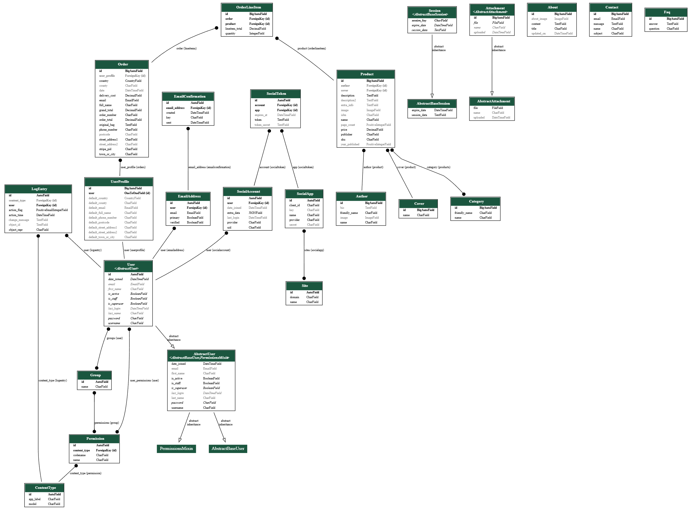
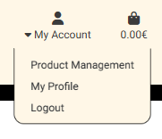
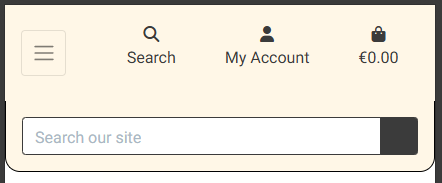
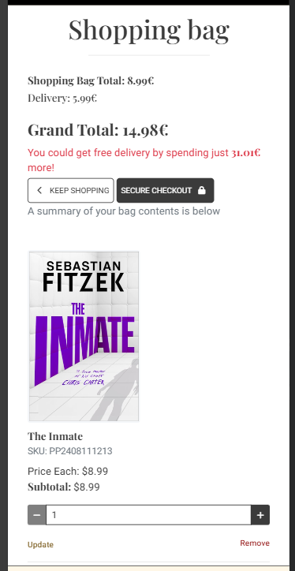
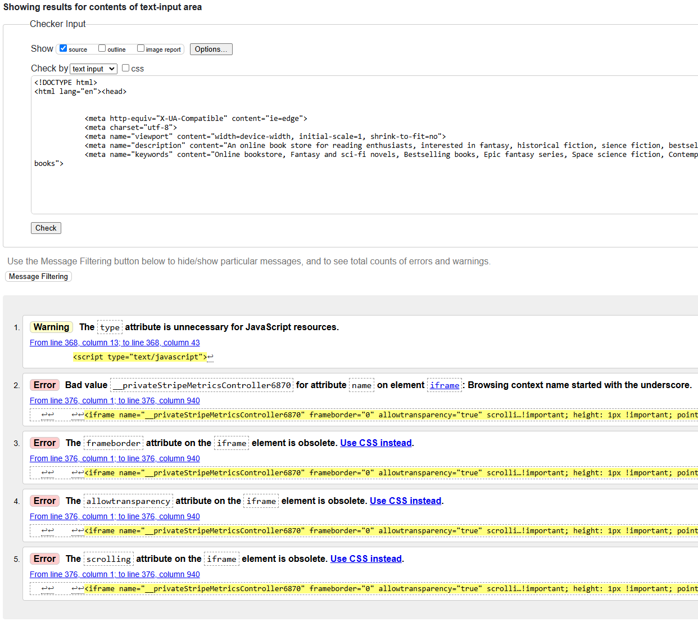
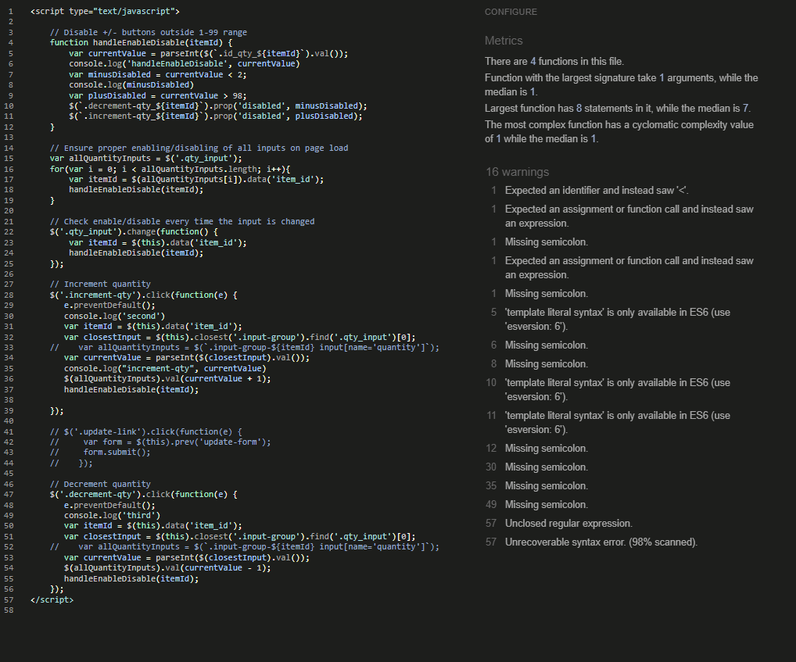

# **Books and Giggles**

Books and Giggles is a fictional online book store that sells a small amount of books from the categories "Historic fiction", "Fantasy", "Science Fiction", "Illustrated books" as well as German originals translated into english, current bestsellers and more. Users are supposed to feel right at home and wanting to stay to browse books or find out information about the authors that we have in stock. The users have the capability to contact the sites admin for suggestions or issues, they can sign up for the sites newsletter and find lots of interesting information throughout the page.

[Access live website here](https://books-and-giggles-dcc63078a535.herokuapp.com/)

 

This fictional site was created for Portfolio Project #5 (Full-Stack Toolkit) - Diploma in Full Stack Software Development Diploma at the [Code Institute](https://www.codeinstitute.net).

# Table of Content

* [**Project**](<#project>)
    * [Objective](<#objective>)
    * [Site Users Goal](<#site-users-goal>)
    * [Site Owners Goal](<#site-owners-goal>)
    * [Business Model](<#business-model>)
    * [Marketing Techniques](<#marketing-techniques>)
    * [Project Management](<#project-management>)
    * [Database Schema](<#database-schema>)

* [**User Experience (UX)**](<#user-experience-ux>)
    * [Wireframes](<#wireframes>)
    * [User Stories](<#user-stories>)
    * [Site Structure](<#site-structure>)
    * [Design Choices](<#design-choices>)

* [**Features**](<#features>)

* [**Existing Features**](<#existing-features>)
    * [Navigation](<#navigation>)
    * [Footer](<#footer>)
    * [Home](<#home>)
    * [About](<#about>)
    * [FAQ](<#faq>)
    * [Contact Page](<#contact-page>)
    * [Newsletter](<#newsletter>)
    * [Products View](<#products-view>)
    * [Product Detail View](<#product-detail-view>)
    * [Shopping Bag](<#shopping-bag>)
    * [Checkout](<#checkout>)
    * [Checkout Success](<#checkout-success>)
    * [Register](<#register>)
    * [Log In](<#log-in>)
    * [Logout](<#logout>)
    * [Profile](<#profile>)
    * [Confirmation Messages](<#confirmation-messages>)
    * [Confirmation Emails](<#confirmation-emails>)
    * [Admin](<#admin>)
    * [Add Product](<#add-product>)
    * [Edit Product](<#edit-product>)
    * [Delete Product](<#delete-product>)
    * [Add Author](<#add-product>)
    * [Edit Author](<#edit-product>)
    * [Delete Author](<#delete-product>)
    * [Add FAQ](<#add-product>)
    * [Edit FAQ](<#edit-product>)
    * [Delete FAQ](<#delete-product>)
    * [Add Category](<#add-product>)
    * [Admin Panel](<#admin-panel>)

* [**Future Features**](<#future-features>)

* [**Technologies Used**](<#technologies-used>)
    * [Languages](<#languages>)
    * [Frameworks & Software](<#frameworks--software>)
    * [Libraries](<#libraries>)

* [**Testing**](<#testing>)
    * [Testing User Stories](<#testing-user-stories>)
    * [Code Validation](<#code-validation>)
    * [Additional Testing](<#additional-testing>)
    * [Known Bugs](<#known-bugs>)
* [Deployment](<#deployment>)
* [Credits](<#credits>)
* [Acknowledgements](<#acknowledgements>)

# Project

## Objective
The idea of creating an online book store came to me from multiple angles - I am not an avid reader, nor do I own a lot of books (most of them are featured on this website) - but there is a deep connection on why I choose to make this my final project for the Code Institute Full Stack Software Developer course: My grandparents were both really into books, my grandmother loved the Angelique series, as well as many other historical fiction books, my grandfather has always enjoyed any kind of illustraded books, mostly of nature, mountains and animals. Unfortunatly, my grandfather passed in July and my grnadmother shortly after starting the project. My partner is also an avid reader, who suggested the idea to me - so I decided to create this project in memory of my grandparents and in dedication to my mother, partner and all the "book worms" in my family. Most of the books featured on this page are owend and were reccomended by them.

### Site Users Goal
Site users can browse through the webpage to gain inspiration for their next book or book series, as well as about the authors themselves. The website is easy to navigate and has an easy checkout procedure. Any user can contact the sites admin for questions, issues or ideas, as well as subscribing to the "Books and Giggles Newsletter" to stay up to date with inventory, promotions and sales. On the about page, the user can learn about the  and all possible questions are answered on the FAQ page. It is easy to create a profile, so that the user can save their information for their next purchaise and keep track of previous orders, but the creation of a profile is not necessary to order.

### Site Owners Goal
Besides providing a fully functional and welcoming E-commerce book store, the admin can modify all important data either via frontend implementation, like adding, editing or deleting products, authors and FAQ items, or through the admin panel, like changing the about page or editing categories. Any contact request will be send to the admin panel, providing important information like name and email. The admin can keep track of orders and collects payment info via [stripe](https://stripe.com) and collects the email addresses on [brevo](https://www.brevo.com/) with the option to send out customized newsletters. More information about all [features](<#existing-features>) and the [future features](<#future-features>) are below.

[Back to top](<#table-of-content>)

## Business Model
Books and Giggles is a Business to Consumer (B2C) E-commerce platform that sells books to everyone. The store has both low priced books for all ages, in addition classics, contemporary books to dystopian sience fiction and true stories about war. Also the store sells a high priced book, intended for collectors.

While providing everything a readers heart could wish for, Books and Giggles encourages their users to interact with the sites owners to make sure the store lives up to its potential. The philosophy behind the store is to be as accommodating for its users as possible. Customer support is an integral part of the business to rather have a smaller, but loyal customer base than to try and focus to become the biggest book store. 

More information about how this would be possible are in the [future features](<#future-features>) section.

[Back to top](<#table-of-content>)

## Marketing Techniques
After doing the callanges from the LMS, I have decided to implement good SEO as well as getting the e-mail marketing in form of the newsletter the main objective. If the website would be an actual E-commerce webpage, I would start by doing social media marketing by myself, as well as paying for targeted social media ads on Facebook and Instagram, as well as Sponsored posts with book influencers on various platforms like TikTok, Instagram and more. For more information, visit the last section of the marketing challange below.

### Challanges
Below are the results of compleating the three challanges from the LMS SEO and Web Marketing lessons:

<b>Challanges</b>

 

#### SEO Challange:

<b>SEO Challange</b>

 

1. Brainstorm your general topics
 

- Historic fiction
- Fantasy
- Science Fiction
- Bestsellers
- German Authors
- Illustrated books

2. Brain dump possible keywords for each of the general topics
 

Historic fiction:

- Classic novels
- Fiction bestsellers
- War novels
- Angélique series

Fantasy:

- Epic fantasy books
- Fantasy series
- Magic and wizards
- Fary tales

Science Fiction:

- Space books
- Dystopian sci-fi
- Time travel stories
- Alien invasion

Bestsellers:

- Top-rated books
- New releases
- Award-winning novels
- Popular authors

German Authors:

- Wolfgang Hohlbein
- Gebrüder Grimm (Brothers Grimm)
- Sebastian Fitzek
- Michael Ende

Illustrated books:

- Animals
- Geograpics
- History

4. Ensure you have a selection of short and long-tail keywords
 

Short-tail:

- Fiction books
- Fantasy novels
- Sci-fi stories
- Bestsellers
- German books
- Warhammer 40K
- Historical fiction

Long-tail:

- Best epic fantasy series
- Top-rated science fiction books
- Popular contemporary fiction authors
- Award-winning historic fiction
- Best illustarated books of all time
- Best releases of this year
- Popular german books
- Books about the horrors of war 

5. Final Keyword Selection
 

- Online fiction bookstore
- Fantasy and sci-fi novels
- Bestselling fiction books
- Epic fantasy series
- Space science fiction
- Contemporary fiction bestsellers
- Dystopian sci-fi novels
- Award-winning fantasy authors
- New sci-fi releases
- Top-rated fantasy books
- Popular fiction writers
- Award-winning historical fiction
- Illustraed books for everyone
- German Authors

[Back to top](<#table-of-content>)

 

#### Content Challenge

<b>Content Challenge</b>

 

1. What do your users need?
 

- Easy navigation through specific genres, categories and/or authors
- General overview of inventory/options/authors
- Detailed book information (and maybe reviews) on detail page
- Easy checkout
- Contact option for questions, ideas and problem solving

2. What information and features can you provide to meet those needs?
 

- Implement an advanced search function with filters for genres, authors, and publication dates
- Create a homepage with featured books, new releases, and bestsellers
- On the detail page, provide comprehensive book descriptions, including plot summaries, author bios (and maybe reader reviews)
- Implement a streamlined, user-friendly checkout process with easy payment option(s)
- Include a prominent "Contact Us" page with various contact methods (email, phone, chat) and a FAQ section

3. How can you make the information easy to understand?
 

- Use clear, concise language in book descriptions and website copy
- Implement a user-friendly interface with intuitive category organization
- Include visual elements like book covers to enhance comprehension
- Offer sorting options (e.g., by popularity, rating, or release date) to help users find relevant titles quickly
- Include a search bar

4. How can you demonstrate expertise, authoritativeness and trustworthiness in your content?
 

- Highlight your store's specialization in specific genres (e.g., historical fiction, fantasy, sci-fi)
- Provide in-depth, well-researched book descriptions (and author biographies)
- Display customer ratings and reviews prominently (optional)
- Include an "About Us" page detailing your company's history and expertise in the book industry

5. Would there be other pages within your own site you could link to from your chosen page? (optional)
 

- Link to related books within the same genre or by the same author
- Create "You might also like" sections on book detail pages
- Link to thematic reading lists or curated collections
- Connect author pages to their respective books

6. Are there opportunities to link back to external websites that already rank highly on Google?
 

- Link to official author websites or social media profiles
- Include links to reputable book review sites or literary awards
- Connect to relevant Wikipedia pages for historical context in historical fiction
- Link to publisher websites for additional book information
- Partner with genre-specific blogs or forums for cross-promotion

7. How can you help users discover other relevant parts of your web application?
 

- Create a "Featured Books" carousel on the homepage and category pages
- Use tags to connect books with similar themes, styles, or time periods
- Develop a newsletter to keep users informed about new releases and promotions
- Create genre-specific landing pages with curated content and featured authors

[Back to top](<#table-of-content>)

 

#### Marketing Types Challenge

<b>Marketing Types Challenge</b>

 

1. Who are your users?
 

- Avid readers of fiction, fantasy, and science fiction
- Book collectors interested in illustrated editions
- Fans of bestselling books
- Readers interested in German literature (in original or translation)
- Adults and young adults who prefer online shopping for books

2. Which online platforms would you find lots of your users?
 

- Goodreads
- Reddit (especially subreddits like r/books)
- TikTok
- Instagram
- Facebook

3. Would your users use social media? If yes, which platforms do you think you would find them on?
 

- Instagram (bookstagram community)
- TikTok (BookTok)
- Reddit (especially subreddits like r/books)
- Twitter 
- Facebook (book groups)
- Pinterest (for visual content related to books and reading)

4. What do your users need? Could you meet that need with useful content? If yes, how could you best deliver that content to them?
 

- Book recommendations
- Reviews and ratings
- Information about new releases
- Author insights

Content ideas: 
 

- Blog posts featuring book reviews and genre discussions
- Author interviews
- Reading lists and themed book collections
- Behind-the-scenes looks at illustrated books

Delivery methods:
 

- Email newsletters
- Social media posts (especially visual content for Instagram and TikTok)
- YouTube videos for in-depth book discussions or author interviews
- Regular blog posts on the website (if blog is implemented/not planned for PP5)

5. Would your business run sales or offer discounts? How do you think your users would most like to hear about these offers?
 

- Email newsletters
- Push notifications (if we have a mobile app)
- Social media posts, especially time-limited offers on Instagram Stories or other social media platforms

6. What are the goals of your business? Which marketing strategies would offer the best ways to meet those goals?
 

- Increase sales and customer base
- Establish the store as a go-to source for fiction, fantasy, and sci-fi books
- Build a community of engaged readers
- Marketing strategies:
- Content marketing (blog posts, videos, podcasts)
- Social media marketing, especially on Instagram and TikTok
- Influencer partnerships with BookTubers or Bookstagrammers
- Email marketing for personalized recommendations and offers
- SEO optimization to improve visibility in search results
- Retargeting ads to re-engage visitors who didn't make a purchase

7. Would your business have a budget to spend on advertising? Or would it need to work with free or low cost options to market itself?
 

Paid (small budget):
 

- Targeted social media ads on Facebook and Instagram
- Sponsored posts with mid-tier book influencers

Free:
 

- Organic social media growth
- Content marketing through our blog and social channels
- Email marketing to our subscriber list

Long-term:
 

- Partnerships with authors for virtual events or Q&As
- Participation in online book communities and forums

 

 

[Back to top](<#table-of-content>)

## Project Management

### Github Board
For organizing and planning my project, I have used the [Github board](https://github.com/users/Mienjung97/projects/9/views/1), which has helped me a lot with planning out and fulfilling the acceptance criterias. I have thoroughly kept the user stories up to date with the coding progress. Additionally, I have used multiple .txt files to keep up with ideas, documentation, my mentor meetings and bugs to implement in this documentation. 

<b>Github Board</b>

 
This picture does not show all user stories. Visit my Github board (link above) to see all user stories.
 
 

 

## Database Schema

The database schema was created with [BugBytes](https://www.youtube.com/watch?v=qzrE7cfc_3Q&t=478s) YouTube video and the corresponding tool [dreampuf](https://dreampuf.github.io/GraphvizOnline/). Due to health issues I could not completely follow my time plan, therefore I was unable to create a database schema myself, which was planned to be done with [Lucid](https://lucid.app/documents#/home?folder_id=recent).

* **Product** - Handles all products
* **Author** - Handles all authors - connected to the product model
* **Categories** - Handles all categories - connected to the product model
* **Cover** - Handles the cover types available - connected to the product model
* **Order** - Handles all orders
* **OrderLineItem** - Handler between the products and a users order for checkout
* **Profile** - Handles the user profile information (full name, delivery information and order history for the specific user). There is a one-to-one relation to the user model to connect it to the standard user model.
* **About** - Handles the about information provided through the admin panel
* **FAQ** - Handles all frequently asked questions
* **Contact** - Handles all contact requests and sends them to the admin panel
* **All-Auth** - Various models included due to all-auth that handle users, email addresses and more

<b>Database Schema (Auto generated)</b>

 

 

# User Experience (UX)

## Wireframes
The wireframes for the site were created in the software [Balsamiq](https://balsamiq.com). The wireframes have been created for desktop, tablet and mobile devices. The text content wasn't finalized during the wireframe process. Also I have decided to only focus on the user side since the admin frontend capabilities are less important for styling.

<b>Wireframes: Home</b>

 

<b>Wireframes: Products</b>

 

<b>Wireframes: Product Detail View</b>

 

<b>Wireframes: Authors</b>

 

<b>Wireframes: Profile</b>

 

<b>Wireframes: About</b>

 

<b>Wireframes: FAQ</b>

 

<b>Wireframes: Contact Us</b>

 

<b>Wireframes: Newsletter</b>

 

## User Stories

<b>Site User</b>

### Site User
|  | | |
|:-------:|:--------|:--------|
| As a Site User | I can enter the page on the 'home' page so that I can see bestsellers and new books immediately | &check; |
| As a Site User | I can see all products and sort them to my preferences so that I can browse all books to see what is interesting for me | &check; |
| As a Site User | I can view detailed information about a book so that I can make an informed purchase decision | &check; |
| As a Site User | I can browse books by categories so that I can find books I'm interested in | &check; |
| As a Site User | I can sort by categories so that I can search for books which category interests me | &check; |
| As a Site User | I can use a search function so that I can find specific books quickly | &check; |
| As a Site User | I can access an authors page so that I can serach for books from a specific author | &check; |
| As a Site User | I can see pictures and infos about authors so that I can get background info on who wrote the book | &check; |
| As a Site User | I can create an account so that I can make purchases and access personalized features | &check; |
| As a Site User | I can log in to my account so that I can access my profile | &check; |
| As a Site User | I can view my order history so that I can track the status of my current and past orders | &check; |
| As a Site User | I can add books to my shopping cart so that I can purchase multiple items at once | &check; |
| As a Site User | I can edit the contents in the shopping cart so that I do not buy items or quantities I do not want | &check; |
| As a Site User | I can proceed through an easy checkout process so that I can complete my purchase without problems | &check; |
| As a Site User | I can safely process payments so that my financial information is secure | &check; |
| As a Site User | I can enter and save my delivery information in my profile so that I can use it for future purchases |
| As a Site User | I will get an email confirmation after a purchase so that I know the order has been placed and I get additional info about it | &check; |
| As a Site User | I can reset my password so that I am not excluded from the page if I forgot my old password | &check; |
| As a Site User | I can access a contact form so that I can submit questions or feedback to the bookstore | &check; |
| As a Site User | I can access the FAQ page so that I get all answers to frequently asked questions | &check; |
| As a Site User | I can view an 'About Us' page so that I can learn more about the bookstore and its expertise | &check; |
| As a Site User | I can subscribe to a newsletter so that I can receive updates about new releases and promotions | &check; |
| As a Site User | I cannot access an invalid url so that a custom error page will give me the information on what went wrong | &check; |
| As a Site User | I can receive a discount and/or free shipping when my purchase exceeds a certain amount so that I am encouraged to place larger orders | &check; |

 

<b>Site Admin</b>

### Site Admin

|  | | |
|:-------:|:--------|:--------|
| As a Site Admin | I can add new books to the store and remove old ones so that I can keep the catalog up-to-date | &check; |
| As a Site Admin | I can create and manage book categories so that I can keep the store organized | &check; |
| As a Site Admin | I can manage user accounts so that there are no unwatend customers | &check; |
| As a Site Admin | I can manage the content of the "About Us" page and other static pages so that I can keep the information current | &check; |
| As a Site Admin | I can change questions and answers for the FAQ page so that I do not have to go through the admin panel | &check; |

 

<b>Developer</b>

### Deleloper

|  | | |
|:-------:|:--------|:--------|
| As a Developer | I can implement SEO best practices so that the website ranks higher in search engine results | &check; |
| As a Developer | I can implement secure coding practices so that the application is protected against common vulnerabilities | &check; |

 

<b>Epics</b>

### Epics

The following describes the epics of which each user story has one. To see which user story has which epic, please visit the [Github board](https://github.com/users/Mienjung97/projects/9/views/1).

* Epic 1: User Authentication and Profile Management
* Epic 2: Product Browsing and Search
* Epic 3: Shopping Cart and Checkout
* Epic 4: Order Management
* Epic 5: Content Management
* Epic 6: Marketing and Communication
* Epic 7: Admin Functionality
* Epic 8: Security and Authentication

 

[Back to top](<#table-of-content>)

## Site Structure

Books and Giggles has been designed so that any user can access every feature without having a profile (User profile and order history excluded), including ordering. The website also has been structured so that every feature works on all screen sizes. 

When a user enters the site, the header has all navigation elements and the body displays a simple text and a caroussel, each redirecting the user towards the corresponding product page. The user can also access every books detail page or get information about the authors on the "Authors" page.

The admin has multiple front end admin capabilities, like adding, editing or deleting products, authors and FAQ items, as well as adding categories. Through the admin panel to which a superuser has a direct button, every other functionality, like recieving the contact requests, is available. 

## Design Choices

### Color Scheme
The color scheme, as well as the styling ideas were developed while coding to mimic the colors of books, paper and bindings

[Coolors](https://coolors.co/) was used to create the color palette:

<b>Color Palette</b>

 
 

[Back to top](<#table-of-content>)

 

### Typography
The fonts used for the site are 'Playfair Display'. Fallback font is sans-serif.

'Playfair Display' is used on the whole webpage. Choosing this font family was because I thought it would fit the theme.

<b>Playfair Display</b>

 
 

 

[Back to top](<#table-of-content>)

# Features
This section is devided in [Existing Features](<#existing-features>) and [Future Features](<#future-features>) since there are more features needed for the production ready page.

## Existing Features

This section will be devided into multiple sub sections:

## Navigational Features

<b>Open</b>

### Navigation
The styling of the navigation bar was heavily influenced by the [Boutique ADO](https://boutique-ado-mj-102bd7708d45.herokuapp.com/) walkthough website, while I tried to keep it as clean as possible. The only differences are between Admins and any other users - in addition to the usual navigation, the admin also has a "Product Management" option in the profile dropdown.

The following is devided into mobile and desktop views, showing how each individual dropdown menu looks according to the screen size:

<b>Navigation Large</b>

* Main Navigation:

* Dropdown Books

* Dropdown Categories

* Dropdown About Us

* Dropdown Profile

* Dropdown Profile Admin

[Back to top](<#table-of-content>)

 

<b>Navigation Small</b>

* Small Navigation:

* Small Navigation opened

* Dropdown Books 

* Dropdown Categories 

* Dropdown About Us 

* Dropdown Profile 

* Dropdown Search 

* Dropdown Profile Admin 

[Back to top](<#table-of-content>)

 

### Footer
The desktop footer shows links to all social media platforms, as well as links for the contact and newsletter page. The latter ones are only in the main navigation for mobile screens available:

<b>Footer</b>

* Footer Dekstop

* Footer Mobile

 

[Back to top](<#table-of-content>)

 

## General Features

<b>Open</b>

### Home
The home page is simplistic, easy to navigate and fully responsive: 

<b>Home</b>

* Home Dekstop

* Home Mobile

* Delivery banner that informs the user about minimum order amount before getting free shipping

* Carousell that displays categories like "Bestsellers", "Our Recommendations" and more

[Back to top](<#table-of-content>)

 

### Authors
The Authors page is simplistic, easy to navigate and fully responsive. It shows all authors that have a book the the store, including a small description and if it was available, a picture of the author (otherwise a placeholder image). When the user clicks the author, he will be redirected to a page that shows only books made by ckicked author. 

<b>Home</b>

* Authors Dekstop

* Authors Mobile

[Back to top](<#table-of-content>)

 

### About
The About page features a welcoming picture, as well as information about the store and its ideology. 

<b>About</b>

[Back to top](<#table-of-content>)

 

### FAQ
On the FAQ page, an admin can add questions with their corresponding answer, so that users of the webpage always have their questions answered. The admin is encouraged to add questions that have been asked via the contact page to the FAQ page.

<b>FAQ</b>

[Back to top](<#table-of-content>)

 

### Contact Page
The Contact Us page features a a form which includes *Name*, *email*, *subject* and *message* that gets send directly towards the admin panel.

<b>Contact Page</b>

* Contact Dekstop

* Contact Mobile

[Back to top](<#table-of-content>)

 

### Newsletter
The Newsletter used in this project was designed and set up with [Brevo](https://www.brevo.com/). At the moment, a user will only get a newsletter subscription confirmation email, but brevo allows to schedule outgoing emails and a variety of other possible marketing option.

<b>Newsletter</b>

* Newsletter Dekstop

* Newsletter Mobile

* Newsletter Confirmation Mail

[Back to top](<#table-of-content>)

 

### Products Page
The Products page shows all available books in the store with a picture, name of the book, the author, what kind of cover it has, all categories it belongs to and the price of the item. The user has to click on the cover picture to get redirected to the detail view. The products page is devided into 4 collumns, which are getting reduced to just one collumn, depending on the screen size.

<b>Products Page</b>

* Products Dekstop

* Products Tablet Big

* Products Tablet Small

* Products Mobile

* Product Search Dekstop

[Back to top](<#table-of-content>)

 

### Product Detail Page
In the Product detail Page, the user gets all the information of each individual item. Not every book has all fields filled out, but mostly, all of the fields are filled out. 

The fields which are available:

* Picture
* Name
* Author
* SKU
* Price
* Page count
* Publisher
* Year published
* ISBN
* Description1
* Description2
* Extra Info
* Type of cover

<b>Product Detail View</b>

* Product Detail View Dekstop

* Product Detail View Mobile

<b>Sorting</b>

The user has the option to sort by price, name and author, both in ascending and descending order.

* Dekstop Sorting high to low price

* Dekstop Sorting low to high price

* Dekstop Sorting

* Mobile Sorting

 

 

[Back to top](<#table-of-content>)

 

## E-commerce Features

<b>Open</b>

### Shopping Bag
The shopping bag does exactly what a shopping bag should do: You can add and remove items, as well as adjusting the quantity of each item in the bag. The bag displays the nessesary information about the product or products the user would like to purchase like name, picture and price. Depending on mobile or desktop view, the layout is a bit different, to make the process to the checkout page as easy as possible. The shopping bag also informs the user about delivery costs or if the minimum for free delivery has been reached.

<b>Shopping Bag</b>

* Shopping Bag Dekstop: Empty

* Shopping Bag Dekstop: No delivery cost

* Shopping Bag Dekstop: Delivery cost

* Shopping Bag Mobile: Empty

* Shopping Bag Mobile: No delivery cost

* Shopping Bag Mobile: Delivery cost

[Back to top](<#table-of-content>)

 

### Checkout
In the checkout view, the user has to provide their name, email, shipping details and credit card details. If the user already has a profile, they can save the information to their profile or if they have already filled out all infos, either through an earlier purchase or by filling out the profile form manually, the checkout form will be pre populated (excluding the payment information).

<b>Checkout</b>

* Checkout Dekstop

* Checkout Mobile

[Back to top](<#table-of-content>)

 

### Checkout Success
The checkout success page provides the user with their order details, including an order summary, order number and the info that a confirmation mail will be send to the by the user provided email address.

<b>Checkout Success</b>

* Checkout Success Dekstop

* Checkout Success Mobile

 

[Back to top](<#table-of-content>)

## Profile Features

<b>Open</b>

### Register
The sign up page is a modified all auth template that fullfills the basic "sign up" features like email and password input and validation and a user name. Also it gives the user twice the option to change to the "sign in" page.

<b>Register</b>

* Sign up Desktop

* Sign up Mobile

[Back to top](<#table-of-content>)

 

### Log In
The Log in page is a modified all auth template that fullfills the basic "sign in" features. The user has to provide an email or username as well as their password. Also it gives the user the option to change to the "sign up" page or to reset their password.

<b>Sign In</b>

* Sign In Desktop

* Sign In Mobile

[Back to top](<#table-of-content>)

 

### Logout
The Logout page is a modified all auth template that fullfills the basic "logout" features - it loggs the user out.

<b>Logout</b>

* Logout Dekstop

* Logout Mobile

[Back to top](<#table-of-content>)

 

### Reset Password
The Reset Password page is a modified all auth template that fullfills the basic "Reset Password" features. A user must provide their email and will get an email with a link to reset their password

<b>Reset Password</b>

* Reset Password Dekstop

* Reset Password Mobile

[Back to top](<#table-of-content>)

 

### Profile
The profile page consists of two parts: The users profile info, including name, email and shipping address and as the second part the order history. If a user clicks on one of the order history items, they will be rediredted to the corresponding checkout success page.

<b>Profile</b>

* Profile Dekstop

* Profile Mobile

* Change Password 

 

[Back to top](<#table-of-content>)

 

 

## Confirmation Features

<b>Open</b>

### Pop Up Messages
There are a variety of different Pop Up messages - depending on what the user (or admin) wants to do, most functionalities are connected to a notification. In general, there are different types of messages:

* Success messages: any action the user does which requires a positive feedback, like adding items to the cart, logging in or an admin updates the database successfully
* Info messages: mostly admin related, which informs about editing the database, or when a user clicks a past oder summary
* Warning message: for endusers, this only appears when the stripe public key is missing - the admin will be presented with this message if they want to delete a product or author
* Error message: this message either informs the user about an error that occured, or if a normal user tries to use an admin path
* Newsletter error message: if the user enters an invalid email format, an error message will appear
* Newsletter success message: if the user subscribes to the newsletter, a success message will appear

Site note: the admin success messages look different than for the users: users only get success confirmation for interacting with the store, so they will be shown a summary of their shopping bag, while the admin does not get the preview (reason: the admin gets success messages more frequently and usually does not shop in their own store).

Below you can see some examples, more are in this [folder](readme/assets/images/features/msg/).

<b>Messages</b>

* Success Message without shopping bag

* Success Message: Shopping bag with delivery cost

* Success Message: Shopping bag without delivery cost

* Info Message: Order history

* Warning Message: Deleting a product

* Error Message: Wrong path

* Newsletter Error / Success Message (There is a visual bug in the desktop version, more in the "Bugs" section)

[Back to top](<#table-of-content>)

 

### Confirmation Emails
When a user registers, they have to confirm their email address with a link they will be provided with in an email. Also if a user places an order, they will get an email confirmation with the details of the order.

<b>Confirmation Emails</b>

* Confirm email address

* Order summary email

 

[Back to top](<#table-of-content>)

 

## Admin Features

<b>Open</b>

### Product Management
When a superuser is logged in, they will get another item in the account dropdown labled "Product Management". On this page, they have the option to navigate to the admin panel without having to modify the url and to add a product, category, author or a FAQ item.

<b>Product Management</b>

* Desktop Product Management Panel

* Mobile Product Management Panel

[Back to top](<#table-of-content>)

 

### Add Product
This is the front end page where an admin can add a product.

<b>Add Product</b>

* Add Product Full Form

[Back to top](<#table-of-content>)

 

### Edit Product
This is the front end page where an admin can edit a product. The button on the product detail page works visually the same as the "Delete FAQ" button

<b>Edit Product</b>

* Edit Product Form

* Edit Product Button

[Back to top](<#table-of-content>)

 

### Delete Product
This is the front end page where an admin can delete a product.

<b>Delete Product</b>

* Desktop Delete Product Confirmation Page

* Mobile Delete Product Confirmation Page

[Back to top](<#table-of-content>)

 

### Add Author
This is the front end page where an admin can add an author. All "Add ..." forms are only shown as desktop version, the mobile versions look like the "Add Category" mobile view.

<b>Add Author</b>

* Add Author

[Back to top](<#table-of-content>)

 

### Edit Author
This is the front end page where an admin can edit an author.

<b>Edit Author</b>

* Desktop Edit Author

* Mobile Edit Author

* Edit / Delete Author Button

[Back to top](<#table-of-content>)

 

### Delete Author
This is the front end page where an admin can delete an author.

<b>Delete Author</b>

* Desktop Delete Author

* Mobile Delete Author

[Back to top](<#table-of-content>)

 

### Add Category
This is the front end page where an admin can add a category. This form is shown in the mobile view as an example on how the other "Add ..." forms look like on a mobile view

<b>Add Category</b>

* Mobile Add Category

[Back to top](<#table-of-content>)

 

### Add FAQ
This is the front end page where an admin can add a FAQ item.

<b>Add FAQ</b>

* Desktop Add FAQ Item

* Desktop Add FAQ Frontend Button

[Back to top](<#table-of-content>)

 

### Edit FAQ
This is the front end page where an admin can add a FAQ item.

<b>Edit FAQ</b>

* Desktop Edit FAQ Item

[Back to top](<#table-of-content>)

 

### Delete FAQ
Deleting an FAQ item is the only front end delete option that does not have its own confirmation page, just a "Delete" button. The reason for this is that deleting an FAQ item vy accident, it only has a small impact on the website and can be re implemented quite easy. Deleting an author or a product would have bigger consequences, therefore they have the delete page.

<b>Delete FAQ</b>

* Desktop Delete FAQ Button

* Desktop Delete FAQ Button Hovered

[Back to top](<#table-of-content>)

 

### Admin Panel
On the admin panel, an admin can access all profiles, email addresses, order, products and every other model. Everything has full CRUD functionality, so all features that do not have a corresponding front end page can be modified here.

<b>Admin Panel</b>

* Desktop Admin Panel

 

[Back to top](<#table-of-content>)

 

 

## Future Features

### Marketing

* For a live website, future features include all the marketing ideas I came up with in in the marketing challange
* An extension of the newsletter: Besides only getting a confirmation email, I would implement another email, timed possibly 24 hours after signing up, giving some sort of discount to make the user come back to the page. Also a bi-weekly or monthly newsletter should be implemented

### Features

* Admin capability: Responding to contact requests via the website
* 

# Technologies Used

## Languages

## Frameworks & Software

## Libraries

# Testing

## Testing User Stories

## Code Validation
The code on the 'Books and Giggles' site has been tested through W3C Markup Validation Service, W3C CSS Validation Service, JSHint and the CodeInstutute pep8 validator. A few errors were found the W3C Markup Validation Service but could either be quite easily fixed (see bugs section) or have to do with third party code, especially Stripe, AWS and Brevo. 

### Markup Validation
While validating the HTML code, I encountered only a few errors. Since the Markup validator is not an admin user, I could only validate the pages availabe for endusers via url input - so with use of the chrome developer tools I validated every admin related page via direct input. The only errors that came up are due to third party code. Proof for all validations are in this [folder](readme/assets/images/validation/html). From my previous project, I know that summernote, wich I use for the "About" page, can throw "font element" errors, which might not be included since I have not updated the content on the "About" page yet.

The following shows some validations, especially the ones that had an error:

<b>HTML Validation URL input</b>

Password Change (Errors):

Home page (Warnings):

Newsletter page (no errors or warnings):

 

<b>HTML Validation direct input</b>

Admin pages via direct input:

Product Management page (Errors):

Checkout page (Errors):

Delete author page (Errors):

 

[Back to top](<#table-of-content>)

### CSS Validaton
When validating my own code the W3C CSS Validator reports no errors. The only errors shown are via url input, which have to do with the third party newsletter provider

<b>CSS Validation Result</b>

base.css:

profile.css:

checkout.css:

URL input:

 

[Back to top](<#table-of-content>)

### PEP Validation
To validate the python files, I have used the [pep8 CodeInstitute linter](https://pep8ci.herokuapp.com/) I have tested all python files in my project without getting any errors. The documentation can be found in the [folder](readme/assets/images/validation/python). Every picture is labled with the first word as the corresponding app and the name of the python file. 45 out of the 47 files reported no error - just the webhook.py file in the checkout app, as well as in the settings the "AUTH_PASSWORD_VALIDATORS" were longer than 79 lines. Both files have been fixed.

[Back to top](<#table-of-content>)

### JavaScript Validation
The JSHint validator results can be seen below, only 3 files are shown. the rest of the validation can be found in this [folder](readme/assets/images/validation/static/js)

No errors were returned when passing through JSHint, the tests reported undefined variables and gave out a total of 8 warnings. None of these are problematic. 

<b>JSHint Validation Result</b>

stripe_elemets:

Quantity input form:

JS for the newsletter:

 

## Additional Testing

### Manual Testing

### Responsiveness Test
The responsive design tests were carried out manually with [Google Chrome DevTools](https://developer.chrome.com/docs/devtools/) and [Multi Device Mockup Generator](https://techsini.com/multi-mockup/).

| Desktop    | Display <1200px       | Display >1200px    |
|------------|-----------------------|--------------------|
| Render     | pass                  | pass               |
| Images     | pass                  | pass               |
| Links      | pass                  | pass               |

| Tablet     | iPad Air              | Asus Zenbook Fold  | iPad Mini | iPad Pro |
|------------|-----------------------|--------------------|-----------|----------|
| Render     | pass                  | pass               | pass      | pass     |
| Images     | pass                  | pass               | pass      | pass     |
| Links      | pass                  | pass               | pass      | pass     |

| Phone      | Galaxy S20 Ultra      | iPhone 12Pro/14 Pro Max    | Pixel 7 / 7 Pro      |
|------------|-----------------------|----------------------------|----------------------|
| Render     | pass                  | pass                       | pass      | pass     |
| Images     | pass                  | pass                       | pass      | pass     |
| Links      | pass                  | pass                       | pass      | pass     |

[Back to top](<#table-of-content>)

### Browser Compatibility
* Google Chrome Version (version 128.0.6613.119)
* Mozilla Firefox (version 127.0 )
* Microsoft Edge (version 128.0.2739.54)

[Back to top](<#table-of-content>)

### Lighthouse
Google Lighthouse in Chrome Developer Tools was used to test the application within the areas of *Performance*, *Accessibility*, *Best Practices* and *SEO*. 

The test results have been mostly positive, besides the performance score (between x and y), as well as accessibility. The latter one has especially on the desktop version (all pages) and the shopping bag and product detail page issues, since there are labels missing for most buttons. I decided that this is not an issue for now since the products are not meant for the visually impaired. In the future features, I do want to implement these as well so that the page is also accessable for the visually impaired, so that they are also able to shop for books as e.g. gifts. 

I have tested every page from Books and Giggles with lighthouse, every picture can be found in this [folder](readme/assets/images/validation/lighthouse)

[Back to top](<#table-of-content>)

### Peer Review
Additional testing of the application was conducted by people outside of the software development field by friends and family. No errors and no issues with design or handling of the site were found. Also my webpage has been tested by fellow Code Insititute students Marcellio and Jan with the same result.

[Back to top](<#table-of-content>)

## Known Bugs

# Deployment

# Credits

## Media

Main page picture: Foto von <a href="https://unsplash.com/de/@claybanks?utm_content=creditCopyText&utm_medium=referral&utm_source=unsplash">Clay Banks</a> auf <a href="https://unsplash.com/de/fotos/interieur-der-bibliothek-z_DkoUqgx6M?utm_content=creditCopyText&utm_medium=referral&utm_source=unsplash">Unsplash</a>
  

Picture for Favicon: Foto von <a href="https://unsplash.com/de/@chrislawton?utm_content=creditCopyText&utm_medium=referral&utm_source=unsplash">Chris Lawton</a> auf <a href="https://unsplash.com/de/fotos/stapel-von-sechs-braunen-gebundenen-buchern-9T346Ij4kGk?utm_content=creditCopyText&utm_medium=referral&utm_source=unsplash">Unsplash</a>
  

"Bookstore" JSON for product fixtures was taken from: https://www.kaggle.com/datasets/bishop36/bookstore, but heavily modified and just used as a base for my products.

Picture for "default" image: Foto von <a href="https://unsplash.com/de/@blazphoto?utm_content=creditCopyText&utm_medium=referral&utm_source=unsplash">Blaz Photo</a> auf <a href="https://unsplash.com/de/fotos/person-mit-buch-die-auf-brauner-oberflache-sitzt-zMRLZh40kms?utm_content=creditCopyText&utm_medium=referral&utm_source=unsplash">Unsplash</a>
  

# Acknowledgements

09.10.2024, Rest in peace Oma

